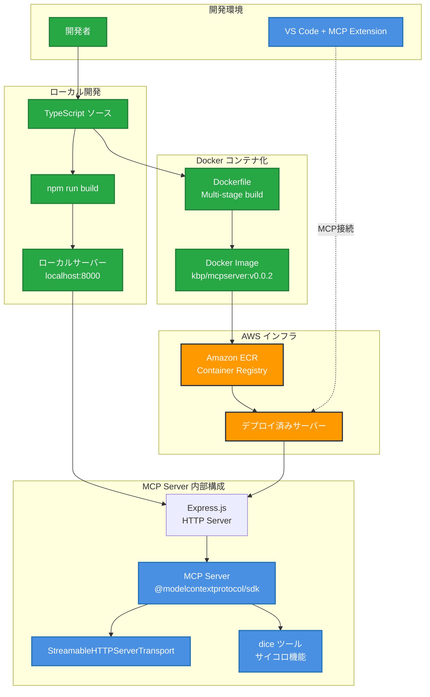

# my-mcp-server-streamable

Streamable MCP Server

## 構成図



## API エンドポイント

| メソッド | エンドポイント | 説明 |
|---------|---------------|------|
| POST | `/mcp` | MCP リクエストを処理 |
| GET | `/mcp` | 405 Method Not Allowed を返す |
| DELETE | `/mcp` | 405 Method Not Allowed を返す |

## 提供ツール

- **dice**: サイコロを振った結果を返すツール
  - パラメータ: `sides` (数値, デフォルト: 10) - サイコロの面の数

```bash
export AWS_REGION=ap-northeast-1
export aws_account_id=123456789012
export REPO_NAME=kbp/mcpserver
export IMAGE_TAG=v0.0.2
```

```bash
docker build -t ${REPO_NAME}:${IMAGE_TAG} .

aws ecr create-repository --repository-name ${REPO_NAME} --region ${AWS_REGION}

aws ecr get-login-password --region ${AWS_REGION} | docker login --username AWS --password-stdin ${aws_account_id}.dkr.ecr.${AWS_REGION}.amazonaws.com

docker tag ${REPO_NAME}:${IMAGE_TAG} ${aws_account_id}.dkr.ecr.${AWS_REGION}.amazonaws.com/${REPO_NAME}:${IMAGE_TAG}

docker push ${aws_account_id}.dkr.ecr.${AWS_REGION}.amazonaws.com/${REPO_NAME}:${IMAGE_TAG}
```
